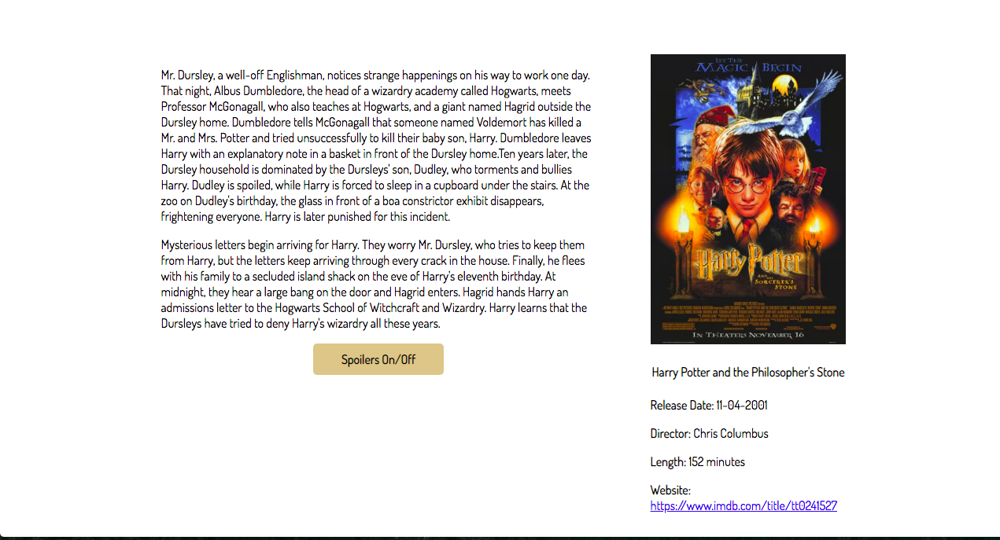

# **Spoiler Free Wiki**

#### _A wiki site that allows users to filter out content containing spoilers, 11.01.2018_

###### By Colin Cook, Luke Vandekieft, Nikki Wong, Kendra Kelly & Julianne Soifer

## Description

Life doesn't always come with a spoiler alert. Have you ever searched online to find specific information about a movie or television series and inadvertently happened upon major spoilers? So have we, and it's the worst. That is why we developed Spoiler Free Wiki. We are a community-based, wiki site that protects against the dreaded spoilers. Our website has built in spoiler filters, so you can see as much, or as little, information about your favorite characters and series.

Our wiki page is for the Harry Potter movie franchise. We currently have entries for all movies in the original series, as well as a growing list of characters. If you choose to view an individual movie synopsis, you will be presented with the basic facts and summary of the movie, as if you were watching a trailer. If you would like to see a full description of the film, you may simply click the button and see the spoiler summary.

Characters may be viewed as they appear in each of the movies. Simply select a character then select a movie to see the overview of their role in the film. If you would like to see a full account of their story in the movie, simply click the button to see the spoiler summary.

As this is a community-based site, users have the ability to add entries to the ever-growing database. Clicking 'Add Character' on the main page will allow you to add a new character and enter all of their details to be displayed on the site.

## Images

##### _Welcome Screen_

##### _Character Page_

##### _Movie Page_

##### _Admin Page_

##### _Add Character Widget_

## Setup/Installation Requirements

#### To view the live site, please visit: 

https://spoiler-free-wiki.firebaseapp.com/

#### If you wish to install the program on your own computer, please follow these instructions:

* Clone repository from [GitHub](https://github.com/nikkiawong/potter-wiki.git) to your computer
* In Terminal, navigate to program directory
* Type ``npm install`` to install dependencies
* Run `ng serve` for a dev server. Navigate to `http://localhost:4200/`. The app will automatically reload if you change any of the source files.

## Technologies Used

* NPM
* Sass
* Angular CLI v1.6.5.
* TypeScript
* Firebase

## Support and contact details

We would love to hear from you! If you have any issues with this application or have any suggestions on how it could be improved, please let us know.

Contact us at [ccook987@gmail.com](mailto:ccook987@gmail.com)

### License

This software is licensed under the MIT license.

Copyright (c) 2018 Colin Cook, Luke Vandekieft, Nikki Wong, Kendra Kelly, Julianne Soifer
